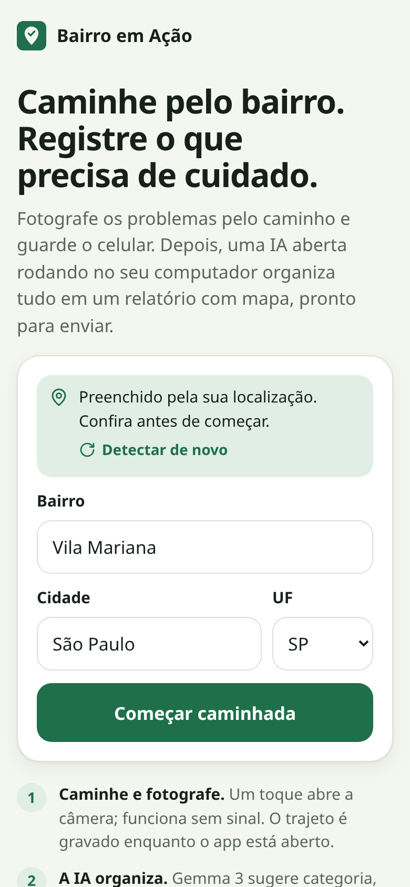
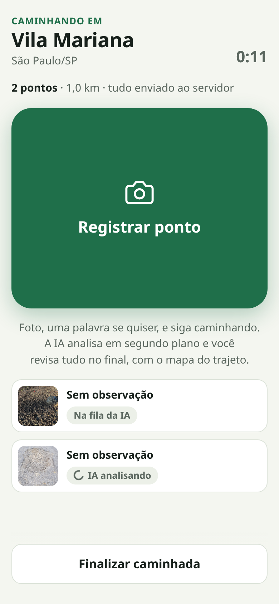
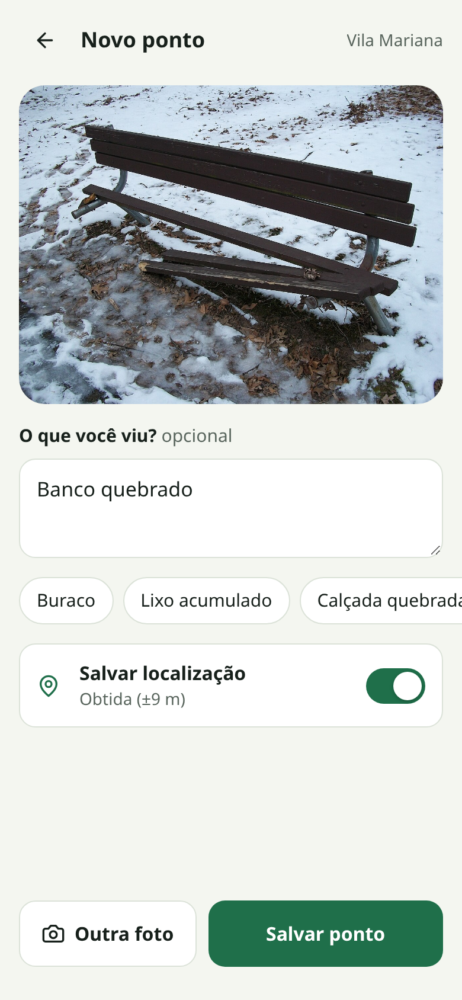
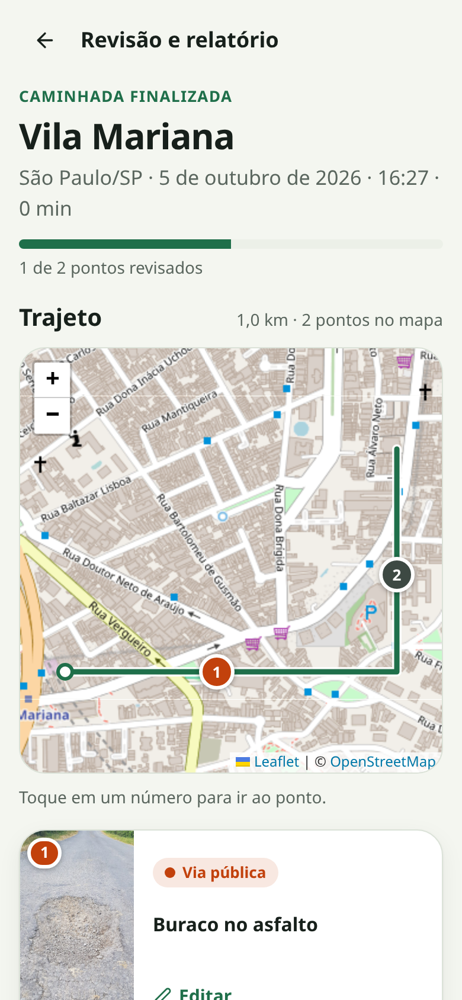
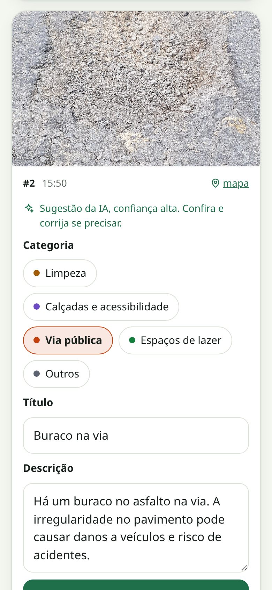
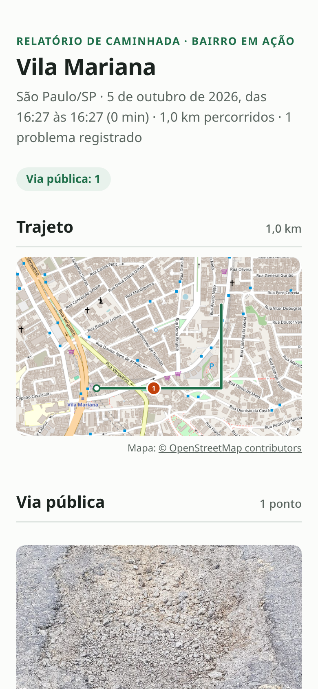

# Bairro em Ação

**Walk your neighborhood, photograph what needs fixing, and get an organized report from an open-weight model running on your own computer.** · *Caminhe pelo bairro, registre problemas nos espaços públicos e transforme fotos em um relatório com IA aberta.*

Bairro em Ação is a mobile web app (interface in Brazilian Portuguese) with a Go API, PostgreSQL and **Gemma 3 4B running locally through Ollama**. Its core is the **walk mode**: during the walk you only take a photo, optionally type a word and keep going. The AI reads each photo in the background. When the walk ends, you review the suggestions and share a report with photos, places and descriptions.

| Start | Walking | New point | Route map | Review | Report |
| --- | --- | --- | --- | --- | --- |
|  |  |  |  |  |  |

- **The screen is the shortest part of the walk.** One tap opens the camera; quick-note chips replace typing; review happens at home.
- **Works with no signal.** Points go into an on-device queue (IndexedDB) and upload by themselves when the server is reachable; a service worker opens the app offline.
- **Photos stay on hardware you control.** The model runs in Ollama on your machine; no cloud AI, no API key, no per-photo cost.
- **Finds where you are.** Neighborhood, city and state are filled in from the phone's location using open data (OpenStreetMap and BrasilAPI). If the neighborhood can't be found, the app asks you to type it.
- **A map of the walk.** The route is recorded while the app is open. At the end, the photographed points are numbered on the map, both in the app and in the report.
- **AI suggests, people decide.** Gemma proposes a category, title and description, and asks for a description when the photo is not enough. The report includes only points a person confirmed.

## Contents

[MVP flow](#mvp-flow) · [Why open-source AI](#why-open-source-ai) · [Validation so far](#validation-so-far) · [Quick start](#quick-start) · [Using it on a phone](#using-it-on-a-phone) · [Architecture](#architecture) · [Configuration](#configuration) · [API](#api) · [Privacy and security](#privacy-and-security) · [Tests](#tests) · [Limitations and next steps](#limitations-and-next-steps) · [Credits](#credits)

## MVP flow

1. **Iniciar caminhada**: the form opens on **Joaçaba/SC** (change it with `VITE_DEFAULT_CITY`/`VITE_DEFAULT_STATE` in `frontend/.env.local`), city and UF first, then the neighborhood.
   - **The neighborhood is a list of that city's neighborhoods** (30 for Joaçaba). Tap to pick, type to filter, or, if yours is missing, type it and choose **"Usar …"**.
     - The list comes from OpenStreetMap through the [Overpass API](https://overpass-api.de), looked up by the IBGE municipality code.
     - The backend tries several public Overpass servers (often overloaded) and **keeps every list in PostgreSQL**. After a city's first lookup it loads instantly and keeps working when Overpass is down.
     - If the server is out of reach, the phone queries Overpass directly. Lists are also cached on the phone for 30 days.
   - **The phone's location fills in the neighborhood** within the default city ([Nominatim](https://nominatim.org), coordinates rounded to about 100 m). A different detected city is only offered ("Usar São Paulo/SP"), never switched to by itself.
   - **City suggestions** come from [BrasilAPI](https://brasilapi.com.br): CPTEC first, falling back to the IBGE municipality list, which carries the IBGE code. When this was built:
     - CPTEC returned HTTP 500 for every query.
     - The `?providers=dados-abertos-br` variant of the IBGE list named every Santa Catarina city "ORD". The app uses the default provider, checks the list for repeated names, and falls back to IBGE's own API.
   - Typing a neighborhood with no city chosen searches Brazil-wide with [Photon](https://photon.komoot.io), an open-source geocoder over OpenStreetMap built for search-as-you-type. Picking a result fills its city and UF.
   - The walk is created on the phone (client-side UUID), so it starts even without signal.
2. **Registrar um ponto**: the big button opens the rear camera. Add a note (or tap a chip such as "Buraco" or "Lixo acumulado") and optionally save the location, which is captured while you type. The photo is re-encoded to 1600 px JPEG before leaving the phone, which also drops EXIF metadata, including any GPS tag.
3. **Analisar com IA**: a single background worker sends each photo with the note to Gemma 3 4B. Ollama's structured output constrains the answer to a JSON schema with the five categories as an enum. Low confidence becomes `needs_info` with a question for the person.
4. **Revisar**: each card shows the suggestion prefilled. Confirm it, or change the category, title or description. For `needs_info` the card shows the AI's question; answer it and ask for a new analysis, or fill it in manually.
5. **Finalizar caminhada**: the GPS route goes to the server along with the end of the walk.
   - The review screen opens with a **map of the route** (Leaflet + OpenStreetMap): a start marker, the distance walked and every photo as a numbered marker in its category color. Tapping a number scrolls to that point.
   - **Zoom:** the mouse wheel or +/- buttons on a computer. On a phone, two fingers, or **Tela cheia** (full screen), where one finger pans; the phone's back button closes it.
   - Photos taken at nearly the same spot are **fanned out around it with a line to the real location**, so every number stays visible at any zoom.
   - The report groups confirmed points by category and comes as one **self-contained HTML file**: photos and a static route map are embedded, there are no scripts, and it opens offline. Share it through the phone's share sheet, download it or print it to PDF.
   - The static map links to the same area on openstreetmap.org for zooming.

Categories: **Limpeza** (lixo acumulado, descarte irregular) · **Calçadas e acessibilidade** (piso danificado, passagem obstruída) · **Via pública** (buraco, sinalização danificada) · **Espaços de lazer** (banco quebrado, equipamento deteriorado) · **Outros** (situações que precisam de descrição manual). Date and location always come from the app, never from the model.

## Why open-source AI

- **Privacy by construction.** Street photos show houses, cars, plates and people, and points carry coordinates. With a local model these never reach a server the walker doesn't control.
- **No signal, no problem.** Capture needs no network at all; the AI runs when you are back home on Wi-Fi. A cloud API would add nothing to the walk and cost data.
- **Free to run at neighborhood scale.** A residents' association can analyze hundreds of photos without per-image fees or quotas.
- **Swappable and measurable.** `OLLAMA_MODEL=gemma3:12b` switches models without code changes. Each suggestion stores the model that produced it, and the AI suggestion is kept apart from the confirmed values, so the report can say how often reviewers kept the AI's category. That makes it possible to compare models on your own photos.
- **Open data all the way.** Places come from OpenStreetMap and BrasilAPI (IBGE), and maps from OpenStreetMap tiles. Each is replaceable: `MAP_TILES_URL` points the report at your own tile server.
- **Changeable behavior.** The prompt (`backend/internal/ai/prompt.go`) and the categories are plain code you can edit for your city.

## Validation so far

The plan says quality has to be validated with real photos. As a first check, eight freely licensed street photos from Wikimedia Commons (see [Credits](#credits)) went through the full pipeline with `gemma3:4b`:

| Photo | First pass | After prompt refinement |
| --- | --- | --- |
| Pothole (×2) | via_publica, alta | — |
| Illegal dumping | limpeza, alta | — |
| Cracked sidewalk | calcadas, alta | — |
| Broken park bench | lazer, alta | — |
| Garbage bags on a corner | limpeza, alta | — |
| Litter left after a street market | limpeza, alta | — |
| Fallen, half-hidden road sign | **outros, média** | via_publica, alta |

- **7 of 8** correct on the first pass. The sign was described correctly ("Placa de sinalização caída na esquina") but filed under "Outros". An explicit rule for signs in the prompt fixed it. Since that rule was tuned on this same photo, treat it as a fix, not as evidence of accuracy.
- Early titles sometimes repeated the neighborhood name ("Calçada rachada na Vila Mariana"). The prompt now forbids that.
- **Speed:** about 75–120 s per photo on a GTX 1050 with 3 GB VRAM (the model is partly on CPU). This is why analysis runs in the background and the walk never waits for it.
- **Still to do:** a real walk with phone photos, measuring the "categoria mantida" rate the report prints.

## Quick start

Requirements: Go 1.25+, Node 20+, Docker (for PostgreSQL) and [Ollama](https://ollama.com).

```bash
# 1. Local model (once)
ollama pull gemma3:4b
ollama serve                      # skip if Ollama already runs as a service

# 2. Database
cp .env.example .env              # change POSTGRES_PASSWORD and the password inside DATABASE_URL
docker compose up -d

# 3. Backend (another terminal)
cd backend && go run ./cmd/server # http://127.0.0.1:8090

# 4. Frontend (another terminal)
cd frontend && npm install && npm run dev   # http://localhost:5174
```

The backend reads `./.env` or `../.env` on start. If Ollama is down, points wait in the queue and are analyzed when it comes back; the review screen says so and offers manual filling.

## Using it on a phone

The notebook becomes the server: one Go process serves the app, the API and the photos over HTTPS on your Wi-Fi.

```bash
./scripts/servidor-celular.sh   # starts PostgreSQL and Ollama if needed, builds the app, serves https://<notebook-ip>:8443
```

It prints the addresses to open on the phone. One-time setup:

1. **Open the port in the firewall** (Ubuntu/Arch with UFW): `sudo ufw allow from 192.168.1.0/24 to any port 8443 proto tcp`.
2. **Trust the notebook's certificate on the phone.** Phones allow GPS, the offline app and secure storage only on trusted HTTPS. On first start the server creates a small certificate authority for this computer in `backend/data/tls/`.
   - Open `https://<notebook-ip>:8443/ca.crt` on the phone and accept the warning once to download it.
   - **Android:** Settings → Security → Encryption & credentials → Install a certificate → **CA certificate** → pick `bairro-em-acao-ca.crt`. The menu names vary by brand; search settings for "certificado CA".
   - **iPhone:** open the link in Safari → allow the profile → Settings → Profile Downloaded → Install. Then Settings → General → About → Certificate Trust Settings → turn on "Bairro em Ação".
   - The authority is reused when the notebook's IP changes, so this is done once. Keep `backend/data/tls/ca-key.pem` private (it is git-ignored and readable only by you), and remove the certificate from the phone when you stop using the app.
3. **Before a walk**, open the app once on the Wi-Fi so it is cached, then go out. Without signal it still opens, records points and keeps them on the phone. Back home, they upload and the AI starts.

To keep the server running across reboots, `deploy/bairro-acao.service` is a systemd user service (no root). Its first lines say how to install it.

**The route is recorded only while the app is on screen.** Browsers stop location updates for pages in the background or with the screen locked. When that happens, the map connects the photographed points instead, and the walk screen says when GPS is paused or denied.

**There is no login.** Anyone on the same Wi-Fi who knows the address can open the app. Use it on a network you trust.

For development, `npm run dev` (port 5174, proxying `/api` to the backend on `127.0.0.1:8090`) is still the quickest loop.

## Architecture

```
Phone (React + TypeScript PWA)                  Your computer
┌────────────────────────────────┐             ┌─────────────────────────────────────┐
│ camera input · note · location │  PUT /api   │ Go API (net/http, stdlib)           │
│ resize + strip EXIF (canvas)   │ ──────────▶ │  ├─ PostgreSQL: walks, occurrences, │
│ GPS route (watchPosition)      │  idempotent │  │   track_points, AI + confirmed   │
│ IndexedDB outbox + track       │             │  ├─ data/photos/<uuid>.jpg          │
│ service worker (app shell)     │ ◀────────── │  ├─ worker ──▶ Ollama /api/chat     │
│ review, Leaflet map, share     │   polling   │  │             gemma3:4b + schema   │
└───────┬────────────────────────┘             │  └─ report.html + static map ──┐    │
        │ place lookup, map tiles              └────────────────────────────────┼────┘
        ▼                                                                       ▼
  Nominatim · Photon (OSM) · BrasilAPI · OSM tiles          OSM tiles (cached in data/tiles)
```

```
backend/
  cmd/server/          entry point, .env loading, graceful shutdown
  internal/walk/       domain: categories, validation, service (idempotent create/record)
  internal/store/      PostgreSQL schema and queries (pgx), queue claim with SKIP LOCKED
  internal/ai/         Ollama client, prompt, JSON schema, response validation
  internal/analyzer/   background worker: one photo at a time, retries while Ollama is down
  internal/photos/     photo files on disk (database keeps only the name)
  internal/report/     self-contained HTML report with a static route map (tiles + SVG overlay)
  internal/tiles/      map tile fetcher with disk cache (2 parallel requests, 30-day cache)
  internal/api/        HTTP handlers
frontend/src/
  screens/             WalkScreen (start + walking), CaptureScreen, ReportScreen (review + report)
  outbox.ts            offline queue in IndexedDB
  track.ts             GPS route recording (kept on the phone until the walk ends)
  places.ts            neighborhood/city/UF detection and city search
  components/WalkMap   Leaflet route map
  image.ts, geo.ts     photo preparation, location, distances
  public/sw.js         offline app shell
```

The AI result (`ai_*` columns) and the person's confirmation (`category`, `title`, `description`, `reviewed_at`) are stored separately. A result that arrives after the person asked for a new analysis is discarded (`WHERE ai_status = 'running'`), and jobs interrupted by a restart go back to the queue.

## Configuration

| Variable | Default | Purpose |
| --- | --- | --- |
| `DATABASE_URL` | — (required) | PostgreSQL connection string |
| `API_ADDR` | `127.0.0.1:8090` | API listen address |
| `PHOTOS_DIR` | `data/photos` | Photo folder, relative to where the backend runs |
| `OLLAMA_URL` | `http://localhost:11434` | Ollama endpoint |
| `OLLAMA_MODEL` | `gemma3:4b` | Any Ollama vision model, e.g. `gemma3:12b` |
| `OLLAMA_TIMEOUT` | `300s` | Per-photo inference limit |
| `REPORT_TIMEZONE` | `America/Sao_Paulo` | Time zone for dates in the downloaded report |
| `OVERPASS_URLS` | overpass-api.de, maps.mail.ru, overpass.private.coffee | Overpass servers tried in order for neighborhood lists |
| `VITE_DEFAULT_CITY` / `VITE_DEFAULT_STATE` (frontend) | `Joaçaba` / `SC` | City every walk starts with |
| `MAP_TILES_URL` | `https://tile.openstreetmap.org/{z}/{x}/{y}.png` | Tiles for the report's static map; `off` draws only the route |
| `MAP_TILES_ATTRIBUTION` | `© OpenStreetMap contributors` | Credit printed under the report map |
| `TILE_CACHE_DIR` | `data/tiles` | Tile cache, relative to where the backend runs |
| `WEB_DIR` | — | Serve the built app (`frontend/dist`) from the backend too |
| `TLS` | — | `auto`: HTTPS with a local certificate authority in `TLS_DIR` (`data/tls`); or set `TLS_CERT`/`TLS_KEY` |
| `CORS_ORIGINS` | `http://localhost:5174,…` | Only needed if the frontend calls the API directly via `VITE_API_URL` |
| `API_TARGET` (frontend) | `http://127.0.0.1:8090` | Where Vite proxies `/api` |

## API

| Method and path | Description |
| --- | --- |
| `GET /api/health` | Database and model availability |
| `GET /api/categories` | The five categories |
| `GET /api/walks` | Recent walks with point and review counts |
| `PUT /api/walks/{id}` | Start a walk (`neighborhood`, `city`, `state` as UF, `started_at`); idempotent |
| `GET /api/walks/{id}` | Walk with all occurrences, AI status and suggestions |
| `POST /api/walks/{id}/finish` | Finish (`finished_at` optional, `track`: GPS points); retrying adds no duplicate points |
| `GET /api/walks/{id}/track` | Recorded GPS route |
| `PUT /api/walks/{id}/occurrences/{occurrence}` | Multipart: `photo`, `note`, `captured_at`, optional `latitude`, `longitude`, `accuracy_m`; idempotent |
| `PATCH /api/occurrences/{id}` | Confirm or correct (`category`, `title`, `description`) |
| `POST /api/occurrences/{id}/analyze` | Queue a new analysis with an updated `note` |
| `DELETE /api/occurrences/{id}` | Remove a point and its photo |
| `GET /api/photos/{name}` | Photo file |
| `GET /api/places/neighborhoods/{ibge_code}?city=` | A municipality's neighborhoods from OpenStreetMap, cached in PostgreSQL |
| `GET /api/walks/{id}/report.html[?download]` | Self-contained report |

## Privacy and security

- This is a **single-user, local MVP with no authentication**. Keep the API on `127.0.0.1` and expose it only on a network you trust.
- Photos are re-encoded on the phone, which removes EXIF metadata (camera GPS included). Location is saved only when the switch is on.
- Uploads are limited to 8 MB and must be JPEG or PNG by magic bytes. Photo names are validated against `<uuid>.jpg|png` before touching the filesystem.
- **Outside services, all open data, none receive photos:**
  - Nominatim gets the coordinates **rounded to about 100 m** (enough for the neighborhood, not the house).
  - Photon (Komoot) gets the neighborhood or city name being typed.
  - Overpass gets the IBGE code of the chosen city, from the server and only once per city.
  - BrasilAPI gets the city name typed or detected.
  - OpenStreetMap's tile servers get map-tile requests: from the phone for the in-app map, and from the backend for the report (cached for 30 days, with an identifying User-Agent, as their policy asks).
- The person's note is sent to the model inside a JSON envelope and the system prompt treats it as data. Output is schema-constrained and validated (category enum, lengths) before storage.
- `report.html` is served with `Content-Security-Policy: default-src 'none'` and contains no scripts; all text is escaped by `html/template`.

## Tests

```bash
cd backend
go test ./...                                   # unit tests: validation, AI parsing, worker, report
TEST_DATABASE_URL="$DATABASE_URL" go test ./... # adds API + PostgreSQL integration tests (throwaway schema)
cd ../frontend && npm run build                 # type-check and production build
```

## Limitations and next steps

- Validate with real walks and real phone photos; compare `gemma3:4b` with `gemma3:12b` using the stored suggestions.
- No accounts or sharing between people yet; one computer serves one group.
- Inference speed depends on your hardware; a small GPU or CPU takes a minute or more per photo.
- The route is only recorded while the app is on screen (a browser limitation); a native wrapper or the Wake Lock API could keep it running.
- Public OSM-based services (Nominatim, Photon, Overpass, tiles) have fair-use limits; a group using this heavily should run its own Nominatim/tile server or use a provider.
- Ideas: duplicate detection across walks, export in the format your city's ombudsman channel accepts.

## Credits

Photos used for validation and in the screenshots, from Wikimedia Commons:
"Pothole in Villeray, Montréal" by Miguel Tremblay (public domain) ·
"Pothole on local Road in County Monaghan" by Computerfan0 (CC0) ·
"Illegal dumping near Swamp Creek in North Lynnwood" by PinchyCC (CC BY-SA 4.0) ·
"Broken sidewalk LA" by Downtowngal (CC BY-SA 4.0) ·
"Broken bench Briant Pond Park Summit NJ 2009" by Tomwsulcer (public domain) ·
"Damaged road sign, Drumnakilly" by Kenneth Allen (CC BY-SA 2.0) ·
"Lixo na rua" by jmerelo (CC BY-SA 2.0) ·
"Caminhão de lixo na rua da praça Benedito Calixto" by Ferik80 (CC BY 4.0).

Built with [Gemma 3](https://ai.google.dev/gemma) (Gemma Terms of Use) served by [Ollama](https://ollama.com).
